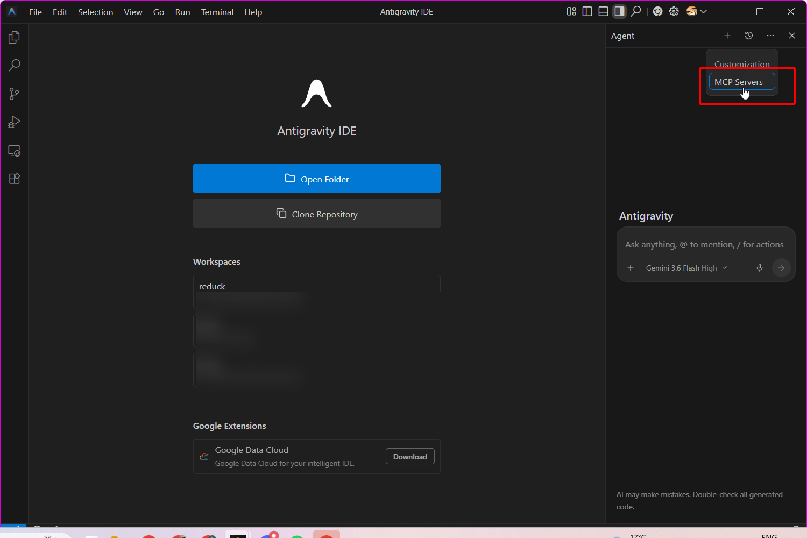
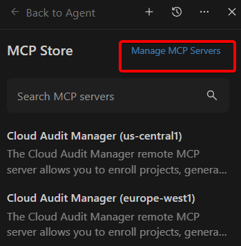
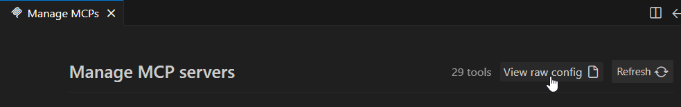
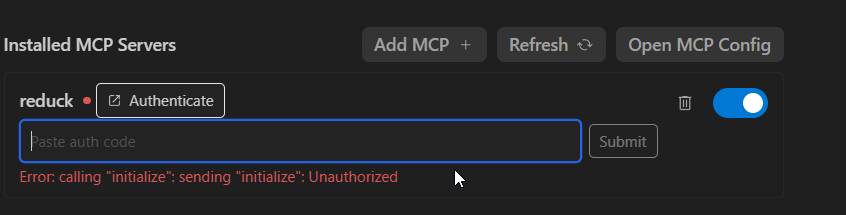

Antigravity connects to Reduck through a raw JSON config rather than a connector picker, so the
setup is a few more clicks than Claude Desktop. The steps below walk through it end to end.

## Before you start

You need a Reduck account, and a paired browser if you want scripts to run on your own Chrome.
Both are in the [quick start](/docs/overview#quick-start).

## Add the server

Click the top-right corner menu icon (**…**), then select **MCP Servers**.



Click **Manage MCP Servers**.



Click **View raw config**.



Add the following to the file:

```json
{
  "mcpServers": {
    "reduck": {
      "serverUrl": "https://mcp.reduck.ai/"
    }
  }
}
```

Save the file and return to **MCP Servers** to confirm `reduck` is listed.

## Confirm it is connected

Open **MCP Servers** and check that `reduck` shows as authenticated. If it does not, click
**Authenticate** and complete sign-in to your Reduck account in the browser tab that opens.



> [!WARNING]
> **The connection drops often.** When it does, Antigravity falls back to running the request
> through the standalone Gemini agent instead of Reduck — so a request can appear to succeed
> without Reduck having run anything. Check that `reduck` is still authenticated before trusting a
> result. Antigravity also disconnects whenever the network or your session is interrupted, and has
> to be reconnected by hand from **MCP Servers → Authenticate**. Both are being worked on.

## If it does not appear

- The config was not saved, or has a syntax error. Reopen **View raw config** and check the JSON is
  valid.
- The URL carries a path or a trailing segment. It is `https://mcp.reduck.ai/` and nothing more.
- Sign-in never finished. Click **Authenticate** next to `reduck` and complete the browser flow
  before running a tool.
- The connection dropped after a network interruption. Re-authenticate from **MCP Servers**.
