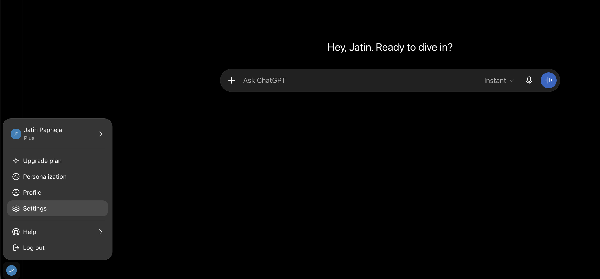
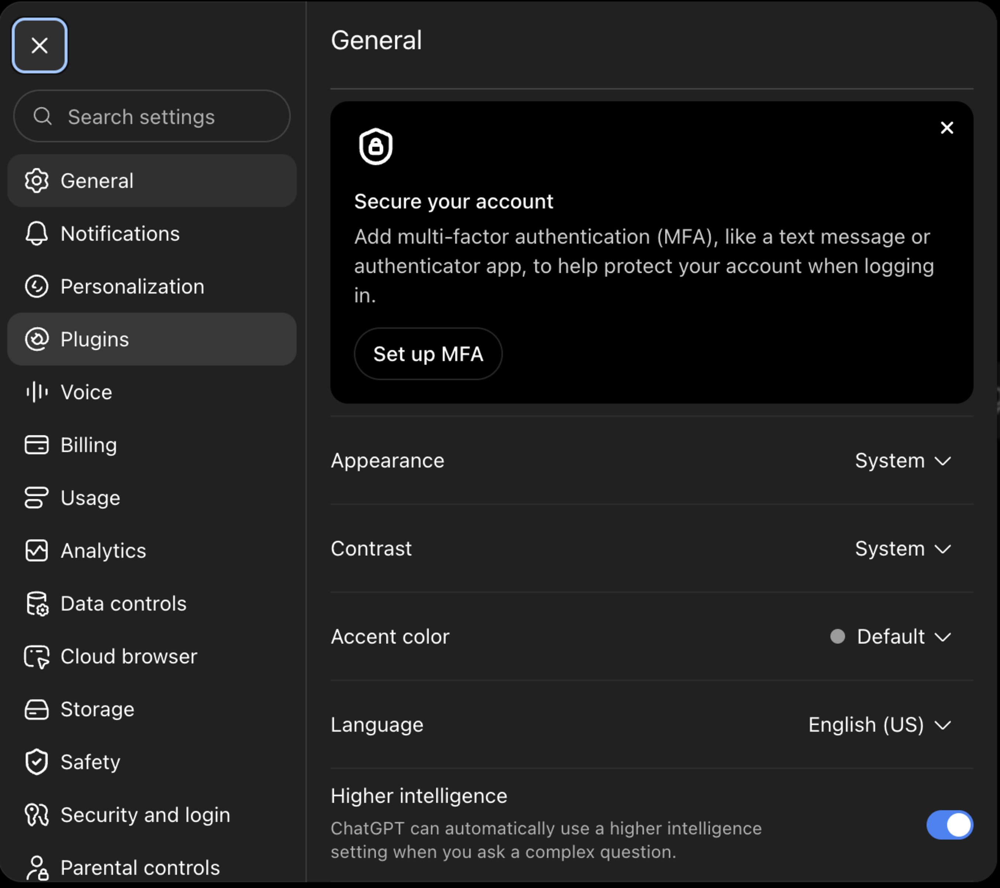
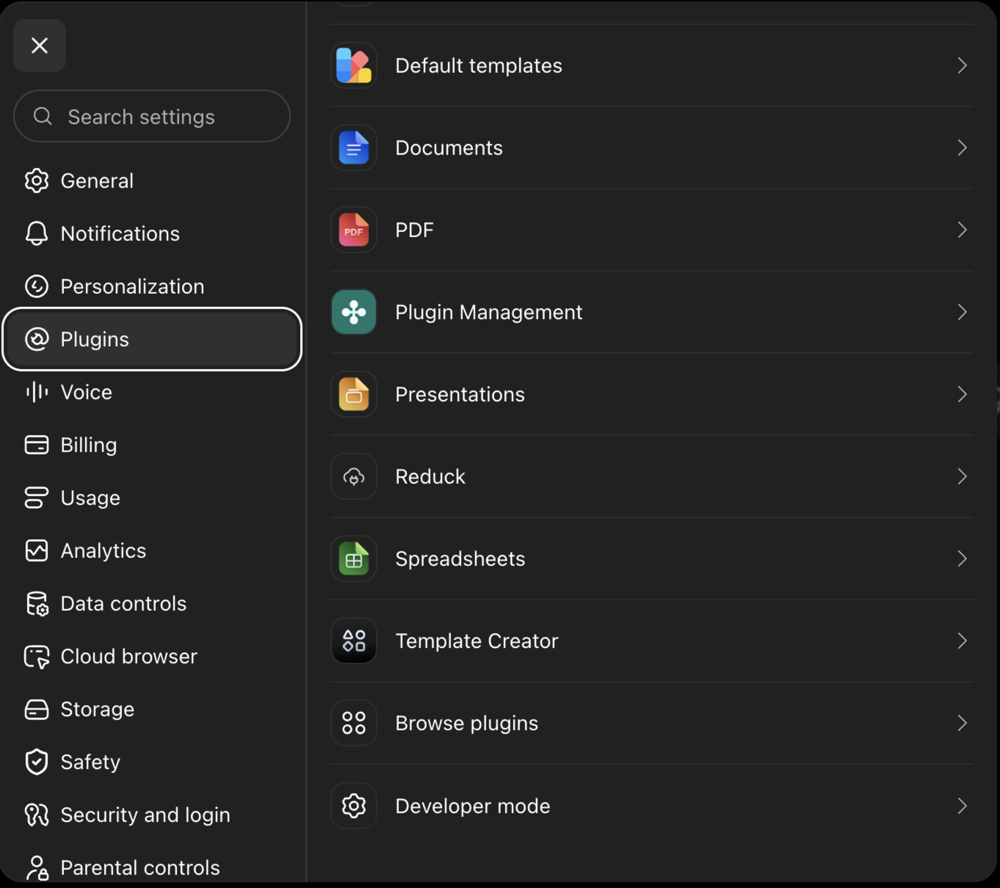
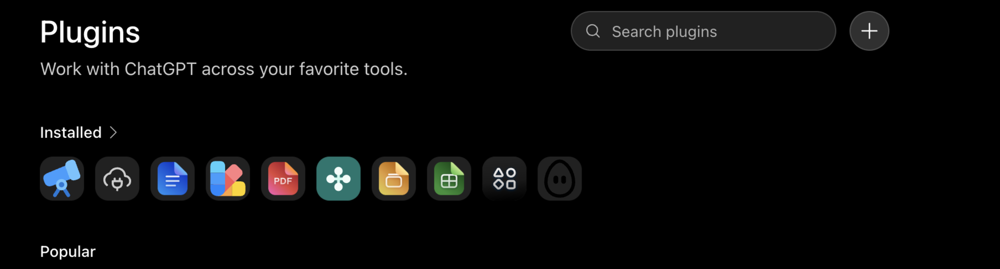
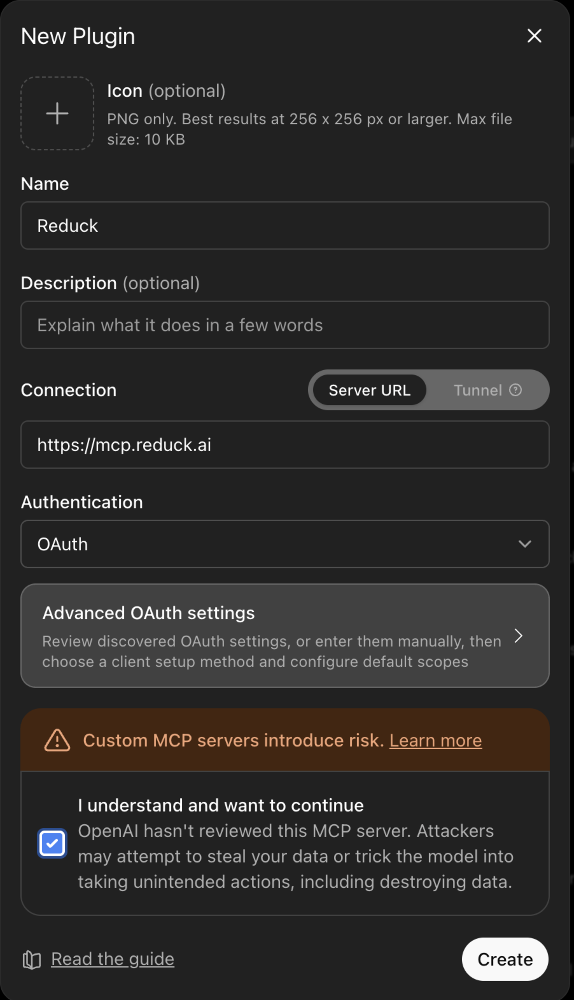

ChatGPT reaches Reduck as a custom connector, added from settings on the web.

## Before you start

You need a Reduck account, and a paired browser if you want scripts to run on your own Chrome.
Both are in the [quick start](/docs/overview#quick-start).

## Add the connector

Open **Settings**, then work through to the connector list.

On the right, click **＋ → Add connection**.

Set the name to `Reduck` and the URL to `https://mcp.reduck.ai`, tick **I understand and want to
continue**, then click **Create**.

## Confirm it is connected

Start a new session. Reduck is listed among the connectors available to it, and the first call
opens a browser to sign in to your Reduck account.

## If it does not appear

- The session predates the connector. A session already running does not pick one up — start a
  new one.
- The consent box was left unticked, so **Create** never completed.
- Sign-in never finished. The browser tab that opens on the first call has to be completed before
  any tool works.
