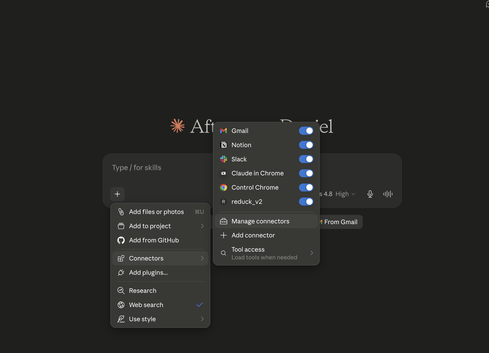
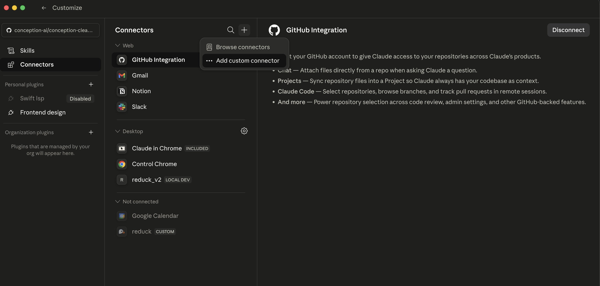
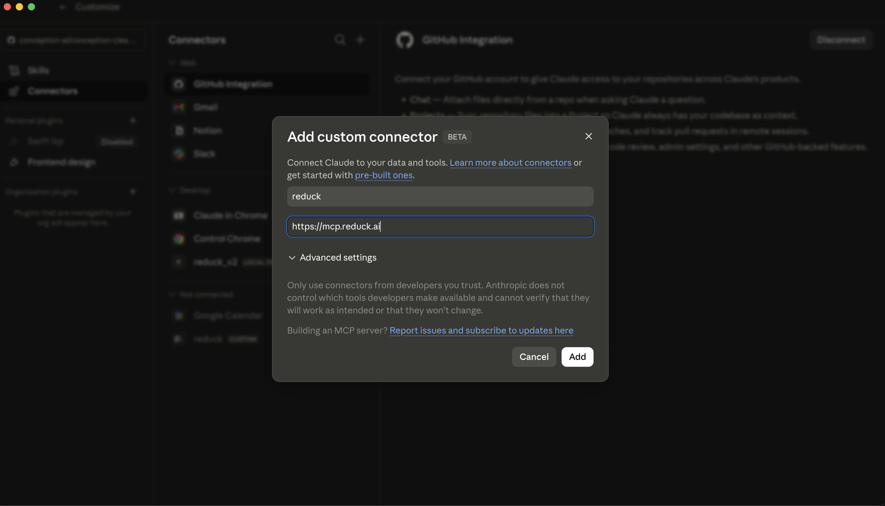

Claude Desktop and Claude on the web share one set of connectors, so adding Reduck once covers
both. The connector follows your Claude account, not the machine.

## Before you start

You need a Reduck account, and a paired browser if you want scripts to run on your own Chrome.
Both are in the [quick start](/docs/overview#quick-start).

## Add the connector

Open **Settings → Connectors**, then **Manage connectors**.



Open **＋ → Add custom connector**.



Set the name to `reduck` and the URL to `https://mcp.reduck.ai`, then save.



Restart Claude Desktop. Claude on the web picks the connector up on the next page load.

## Confirm it is connected

Start a new chat and open the tools menu. Reduck is listed, and the first call opens a browser to
sign in to your Reduck account.

## Run your first script

Connecting the agent is not the last step of setup — a run is. Ask your agent to do something on a
website, and it searches the official library, picks the scripts it needs, and runs them for you.

```text
Use Reduck to fetch the latest X.com reposts by Reduck AI
```

Once it runs, finish setup at [reduck.ai/setup](https://reduck.ai/setup).

## If it does not appear

- Claude Desktop was not restarted. A running app does not pick up a new connector.
- The URL carries a path or a trailing segment. It is `https://mcp.reduck.ai` and nothing more.
- Sign-in never finished. The browser tab that opens on the first call has to be completed before
  any tool works.
