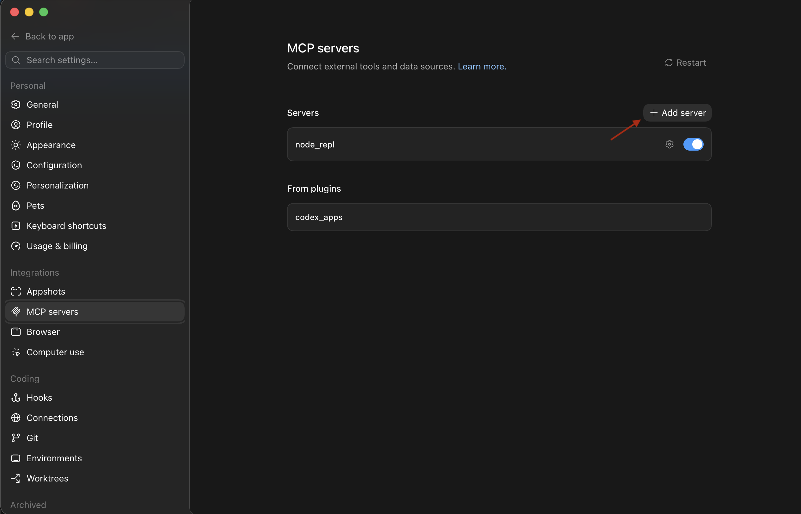
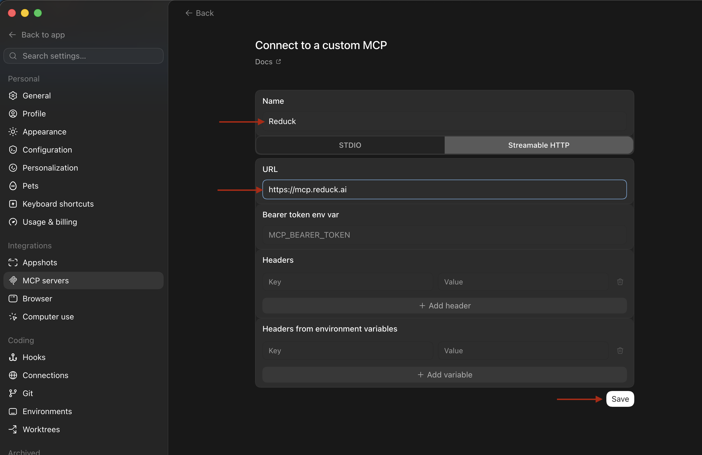

Codex Desktop adds MCP servers from its settings, and shares `~/.codex/config.toml` with the
command line.

> [!WARNING]
> **Codex Pro is required.** MCP servers are not available to free Codex accounts.

## Before you start

You need a Reduck account, and a paired browser if you want scripts to run on your own Chrome.
Both are in the [quick start](/docs/overview#quick-start).

Install the Codex version Reduck is tested against:

```bash
npm i -g @openai/codex@0.141.0
```

Pin that version. Later releases have broken the connection to Reduck.

## Add the server

Open **Settings → MCP servers** and click **＋ Add server**.



Select **Streamable HTTP**, set the name to `Reduck` and the URL to `https://mcp.reduck.ai`, then
save.



Restart Codex.

## Confirm it is connected

Run `/mcp` in a session. Reduck is listed, and the first call opens a browser to sign in to your
Reduck account.

## Settings worth changing

Codex asks for approval before each tool call, which interrupts a script mid-run. To let Reduck
run unattended, set the approval mode for the server in `~/.codex/config.toml`:

```toml
[mcp_servers.reduck]
url = "https://mcp.reduck.ai"
default_tools_approval_mode = "auto"
```

This applies to Reduck alone; every other server keeps asking.

To lift approvals for one session instead, start Codex with `codex --full-auto` — sandbox
`workspace-write`, approval `on-failure`. That choice lasts only as long as the session.

## Run your first script

Connecting the agent is not the last step of setup — a run is. Ask your agent to do something on a
website, and it searches the official library, picks the scripts it needs, and runs them for you.

```text
Use Reduck to fetch the latest X.com reposts by Reduck AI
```

Once it runs, finish setup at [reduck.ai/setup](https://reduck.ai/setup).

## If it does not appear

- The account is on the free tier. Codex Pro is required for MCP servers.
- The server was added as stdio rather than **Streamable HTTP**. A stdio server expects a command
  to launch, and Reduck is a URL.
- Codex was not restarted after the server was added.
