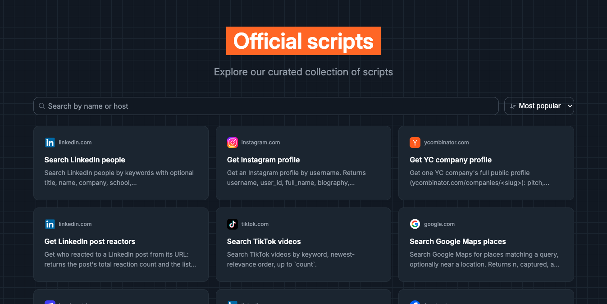

## Scripts

The core unit on Reduck is a **script**: deterministic code that automates a flow on a browser.

Scripts can be **discovered** through the [official library](#official-scripts-library), **run**
with MCP or the API, or **built** with our MCP.

Reduck offers two visibility levels for scripts:

- **Public scripts** can be discovered by the Reduck community and may eventually be featured in
  the official scripts library.
- **Private scripts** remain yours alone. To share them with your team, assign them to a
  [project](#projects) and grant your team access to that project.

### Official scripts library

Reduck's team maintains an official library of scripts on the most common websites (LinkedIn,
Airbnb, Instagram, etc.) that you can find at [reduck.ai/explore](https://reduck.ai/explore).

Your agent will know naturally how to discover and use these scripts through the MCP.

### Projects

You can create your own custom scripts that end up in a **project**: a private workspace for
scripts you build yourself, as opposed to the official scripts library maintained by Reduck's team.

Projects let you automate flows specific to your own stack that you want to share with your team
without exposing them to the broader Reduck community.

1. **Create a project** at [reduck.ai/projects/create](https://reduck.ai/projects/create).
2. **Assign scripts to a project**: either ask your agent to assign it during creation, or move an
   existing script afterward from your script list into the project and set its visibility to
   team-only.

## Browser

Reduck runs automation scripts using two main modes:

- **Default: Bring your own browser (BYOB)**. Browser automation happens on your browser through
  the Reduck extension. The automation automatically inherits your browser state, e.g. which site
  you are logged in, browser fingerprints for stealth, etc. but **requires your browser to be
  open**.
- **Managed browser**. Browser automation happens on Reduck managed Cloud so that you can run
  automations 24/7 without having to have your browser accessible and can scale better than your
  machine. Managed browser is subject to a different pricing (more expensive) than BYOB (see our
  [Pricing page](https://reduck.ai/pricing) for more info).

> [!NOTE]
> A managed browser starts with no session of yours, so a script that needs a login either signs
> itself in, or uses a [connector](/docs/connectors): the cookies for one site, uploaded from your
> own Chrome. Managed runs are enabled per account; the [REST API](/docs/api-reference) is the door
> built for them.

When to use which:

|              | Bring your own browser          | Managed browser                                |
| ------------ | ------------------------------- | ---------------------------------------------- |
| Volume       | Under ~100 script runs per hour | Deployment at scale                            |
| Cost         | Cheaper                         | More expensive                                 |
| Credentials  | Never leave your browser        | Script signs itself in, or a connector         |
| Availability | Needs your browser open         | 24/7                                           |
| Network      | Your connection                 | Datacenter, or a residential proxy per country |
