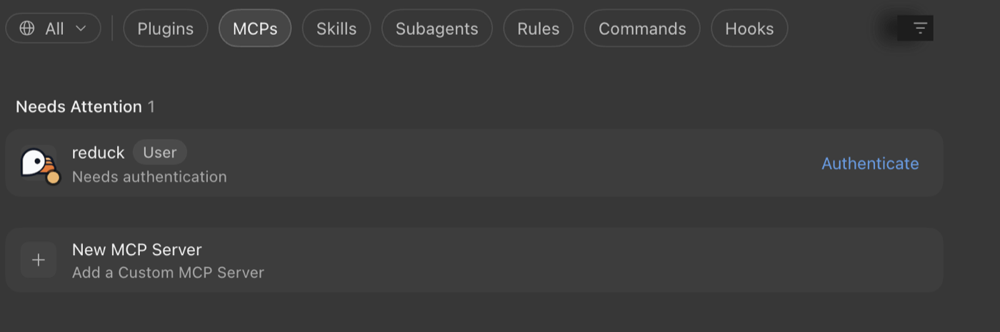
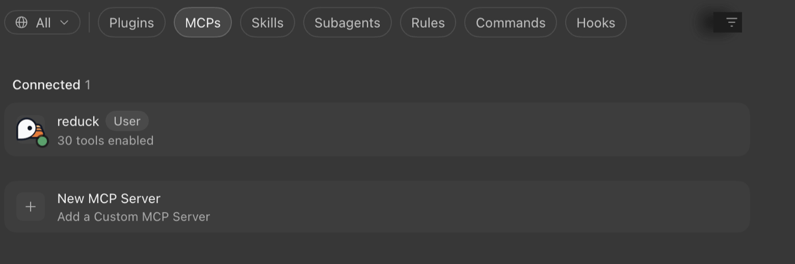

Cursor keeps its MCP servers in a JSON file. There is nothing to install: add the file, then
approve Reduck once inside Cursor.

## Before you start

You need a Reduck account, and a paired browser if you want scripts to run in your own Chrome.
Both are in the [quick start](/docs/overview#quick-start).

## Add the server

Put this in `~/.cursor/mcp.json` to use Reduck in every project:

```json
{
  "mcpServers": {
    "reduck": {
      "url": "https://mcp.reduck.ai"
    }
  }
}
```

To use it in one project only, put the same thing in `.cursor/mcp.json` in that project's folder.

That is the whole entry. You do not need a client ID, a secret, or a list of permissions — Reduck
sets all that up itself the first time Cursor connects.

## Approve it

Open **Customize** in Cursor's sidebar and choose **MCPs**. Reduck appears under **Needs
Attention**, marked *Needs authentication*. Click **Authenticate** and approve it in the browser
tab that opens.



Until you do, Reduck shows no tools. That looks like a broken setup, but it is not — it simply has
not been approved yet.

> [!NOTE]
> Older versions of Cursor kept this under **Settings → MCP**. Plugins, MCPs, Skills and Rules
> have moved to **Customize**, and Settings now points you there.

## Check that it worked

Reduck moves to **Connected** and shows how many tools it has.



Then ask Cursor in a chat to run `whoami`. It tells you which Reduck account you are signed in as.
That is worth checking, because signing in uses whichever Reduck account your browser is already
logged into — if you have more than one, it may not be the one you meant.

## When there is no browser

Some setups have no browser to sign in with, such as Cloud Agents or a CI server. Use an
[API key](/docs/api-reference) there instead:

```json
{
  "mcpServers": {
    "reduck": {
      "url": "https://mcp.reduck.ai",
      "headers": {
        "X-API-Key": "${env:REDUCK_API_KEY}"
      }
    }
  }
}
```

`${env:REDUCK_API_KEY}` reads the key from your environment, so the key itself never sits in the
file. Set it in your shell profile: Cursor's `envFile` setting does not apply to servers like this
one.

## If Reduck does not show up

- **Cursor was not restarted** after you changed the file.
- **The entry uses `command` instead of `url`.** `command` is for servers that run as a program on
  your own machine. Reduck is a web address, so it needs `url`.
- **The approval ran out.** If Cursor goes unused for a long time, the sign-in stops working and
  Reduck quietly goes back to needing approval. Approve it again.
