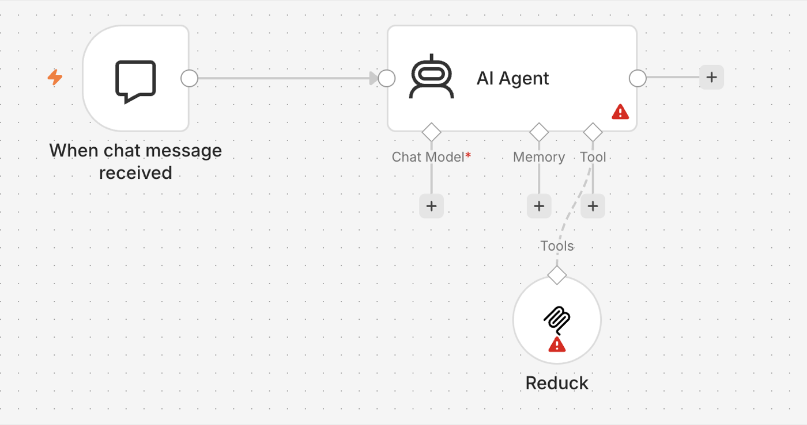

n8n connects to Reduck with its built-in **MCP Client Tool** node. Attach that node to an AI
Agent, and the agent can use the Reduck tools alongside everything else in the workflow.

## Before you start

You need a Reduck account, and a paired browser if you want scripts to run in your own Chrome.
Both are in the [quick start](/docs/overview#quick-start).

You also need an [API key](/docs/api-reference) from your Reduck dashboard. n8n usually runs on a
server with no browser to sign in with, so the key is what identifies you instead.

## Add the node

1. Add an **AI Agent** node to your workflow.
2. On its **Tool** connector, add an **MCP Client Tool** node.

   

3. Fill it in:

| Field | Value |
| --- | --- |
| Endpoint URL | `https://mcp.reduck.ai` |
| Server Transport | **HTTP Streamable** |
| Authentication | **Header Auth** |
| Credential → Name | `X-API-Key` |
| Credential → Value | your Reduck API key |

Leave **Server Transport** on HTTP Streamable — that is what Reduck uses. The other choice, Server
Sent Events, is out of date and will not connect.

## Give it more time

Open **Options → Timeout** and raise it. **The node waits one minute by default, which is not
enough for Reduck.** Running a script opens a real browser and loads a real page, and on a slow
site that easily takes longer than a minute even when everything is working.

Start with `300000` (five minutes), and lower it later if you know your scripts are quick.

This is the most common reason a Reduck node fails in n8n while the same script works everywhere
else.

## Show the agent fewer tools

Reduck comes with 30 tools, and most of them are for building scripts rather than running them. An
agent that only needs to run existing scripts does better with a short list.

Set **Include Tools** to *Selected* and pick:

- `list_scripts` — find a script for the site
- `read_script` — see what information it needs
- `run_script` — run it

Add `list_devices` if the workflow chooses a browser itself, and `list_runs` or
`read_run_results` if it needs to look at a run afterwards.

## Check that it worked

Open the MCP Client Tool node. Once the key is accepted, the node lists the tools it found. Then
run the workflow once and ask the agent to run `whoami` — it tells you which Reduck account the
key belongs to.
